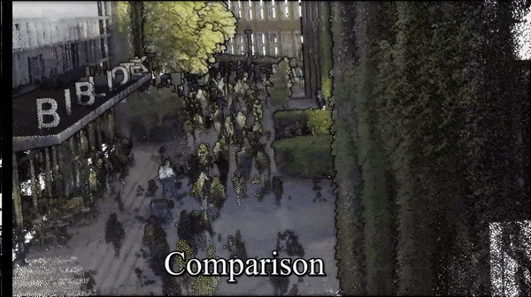
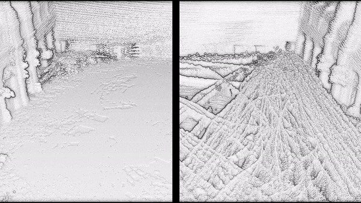
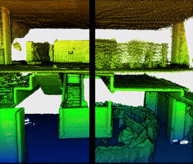
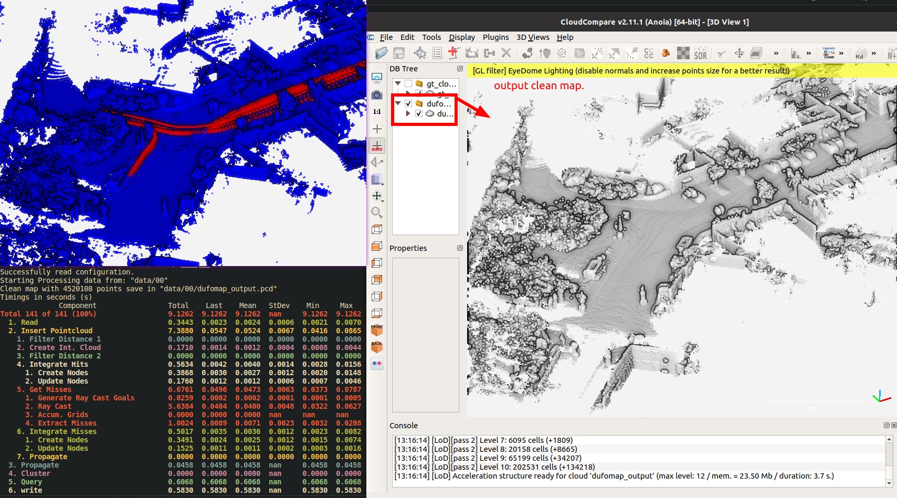

<p>
  <h1 align="center">DUFOMap: Efficient Dynamic Awareness Mapping</h1>
</p>

[](https://arxiv.org/abs/2403.01449)
[](https://KTH-RPL.github.io/dufomap)
[](https://mit-spark.github.io/Longterm-Perception-WS/assets/proceedings/DUFOMap/poster.pdf)
[](https://youtu.be/isDnAVoVD5M)

Quick Demo: Run with the **same parameter setting** without tuning for different sensor (e.g 16, 32, 64, and 128 channel LiDAR and Livox-series mid360), the following shows the data collected from:

| Leica-RTC360 | 128-channel LiDAR | Livox-mid360 |
| ------- | ------- | ------- |
|  |  |  |
<!-- | ------- | ------- | ------- | -->

🚀 2024-11-20: Update dufomap Python API from [SeFlow](https://github.com/KTH-RPL/SeFlow) try it now! `pip install dufomap` and run `python main.py --data_dir data/00` to get the cleaned map directly. Support all >=Python 3.8 in Windows and Linux. Please extract your own data to **the unified format** first follow [this wiki page](https://kth-rpl.github.io/DynamicMap_Benchmark/data/creation/#custom-data).


Clone quickly and init submodules:
```bash
git clone --recursive -b main --single-branch https://github.com/KTH-RPL/dufomap.git


# The easiest way to run DUFOMap:
pip install dufomap
python main.py --data_dir data/00
```


### Dependencies

If you want to compile the C++ source version, please install the following dependencies:

```bash
sudo apt update && sudo apt install gcc-10 g++-10
sudo apt install libtbb-dev liblz4-dev
```

Or you can directly build docker image through our [Dockerfile](Dockerfile):
```bash
docker build -t dufomap .
```

### 1. Build & Run

Build:

```bash
cmake -B build -D CMAKE_CXX_COMPILER=g++-10 && cmake --build build
```

Prepare Data: Teaser data (KITTI 00: 384.4Mb) can be downloaded via follow commands, more data detail can be found in the [dataset section](https://kth-rpl.github.io/DynamicMap_Benchmark/data) or format your own dataset follow [custom dataset section](https://kth-rpl.github.io/DynamicMap_Benchmark/data/creation/#custom-data).

```bash
wget https://zenodo.org/records/8160051/files/00.zip -p data
unzip data/00.zip -d data
```

Run:

```bash
./build/dufomap_run data/00 assets/config.toml
```



## 2. Evaluation

Please reference to [DynamicMap_Benchmark](https://github.com/KTH-RPL/DynamicMap_Benchmark) for the evaluation of DUFOMap and comparison with other dynamic removal  methods.

[Evaluation Section link](https://github.com/KTH-RPL/DynamicMap_Benchmark/blob/master/scripts/README.md#evaluation)


## Acknowledgements

Thanks to HKUST Ramlab's members: Bowen Yang, Lu Gan, Mingkai Tang, and Yingbing Chen, who help collect additional datasets. 

This work was partially supported by the Wallenberg AI, Autonomous Systems and Software Program ([WASP](https://wasp-sweden.org/)) funded by the Knut and Alice Wallenberg Foundation including the WASP NEST PerCorSo.

Feel free to explore below projects that use [ufomap](https://github.com/UnknownFreeOccupied/ufomap) (attach code links as follows):
- [RA-L'24 DUFOMap, Dynamic Awareness]()
- [RA-L'23 SLICT, SLAM](https://github.com/brytsknguyen/slict)
- [RA-L'20 UFOMap, Mapping Framework](https://github.com/UnknownFreeOccupied/ufomap)

### Citation

Please cite our works if you find these useful for your research.

```
@article{daniel2024dufomap,
  author={Duberg, Daniel and Zhang, Qingwen and Jia, MingKai and Jensfelt, Patric},
  journal={IEEE Robotics and Automation Letters}, 
  title={{DUFOMap}: Efficient Dynamic Awareness Mapping}, 
  year={2024},
  volume={9},
  number={6},
  pages={1-8},
  doi={10.1109/LRA.2024.3387658}
}
@article{duberg2020ufomap,
  author={Duberg, Daniel and Jensfelt, Patric},
  journal={IEEE Robotics and Automation Letters}, 
  title={{UFOMap}: An Efficient Probabilistic 3D Mapping Framework That Embraces the Unknown}, 
  year={2020},
  volume={5},
  number={4},
  pages={6411-6418},
  doi={10.1109/LRA.2020.3013861}
}
@inproceedings{zhang2023benchmark,
  author={Zhang, Qingwen and Duberg, Daniel and Geng, Ruoyu and Jia, Mingkai and Wang, Lujia and Jensfelt, Patric},
  booktitle={IEEE 26th International Conference on Intelligent Transportation Systems (ITSC)}, 
  title={A Dynamic Points Removal Benchmark in Point Cloud Maps}, 
  year={2023},
  pages={608-614},
  doi={10.1109/ITSC57777.2023.10422094}
}
```
