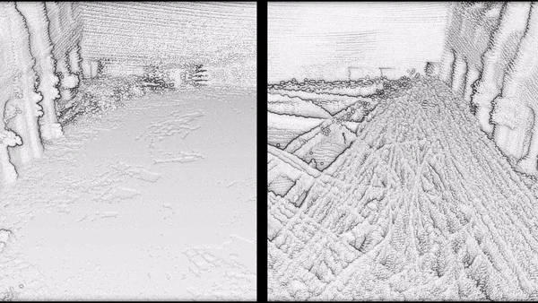
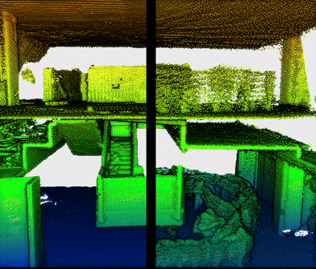

DUFOMap
---

DUFOMap is under review, codes will be public after the paper's acceptance. Stay tuned with us! 😊

https://github.com/KTH-RPL/dufomap/assets/35365764/5185ae01-15cf-4a00-9bff-a9666fd9f7a6

Always Run with the **same parameter setting** without tuning for 16, 32, 64, and 128 channel LiDAR and Livox-series mid360, the following shows the 128 and mid360 effect.

|  |  |
| ------- | ------- |

We will soon public the paper (before 15th March), while the code only will be public after the paper's acceptance. 